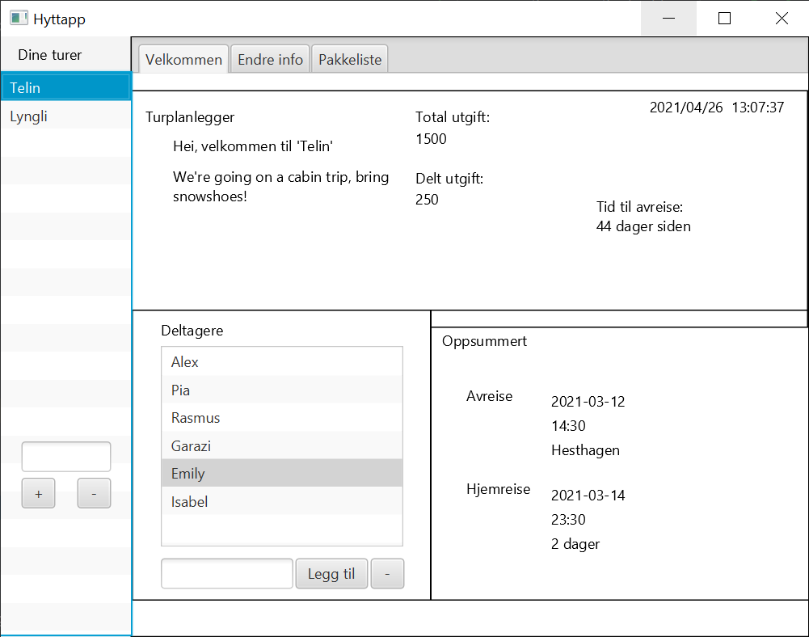

# Objekt Orientert Programmering

Her ligger OOP øvinger og prosjektoppgaven for faget.

  

## Prosjektet

Prosjektet er laget med Java og JavaFXML.  
Mer om prosjektet finner du [her](https://github.com/Hoyby/NTNU/tree/master/TDT4100-OOP/Project).

